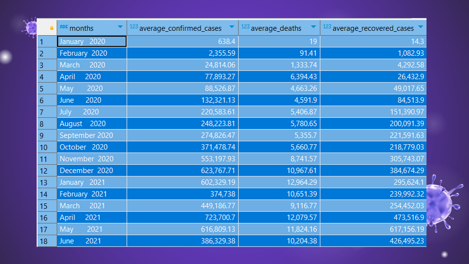
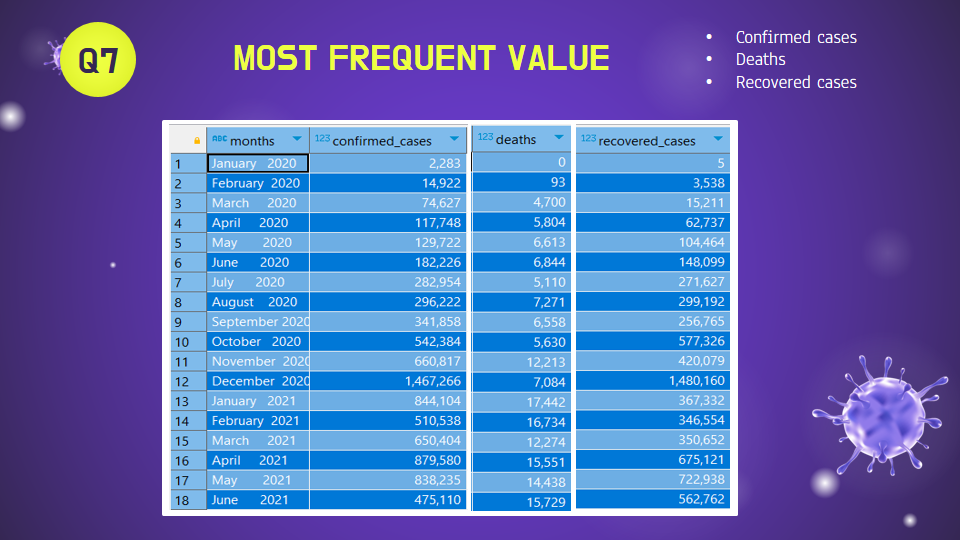
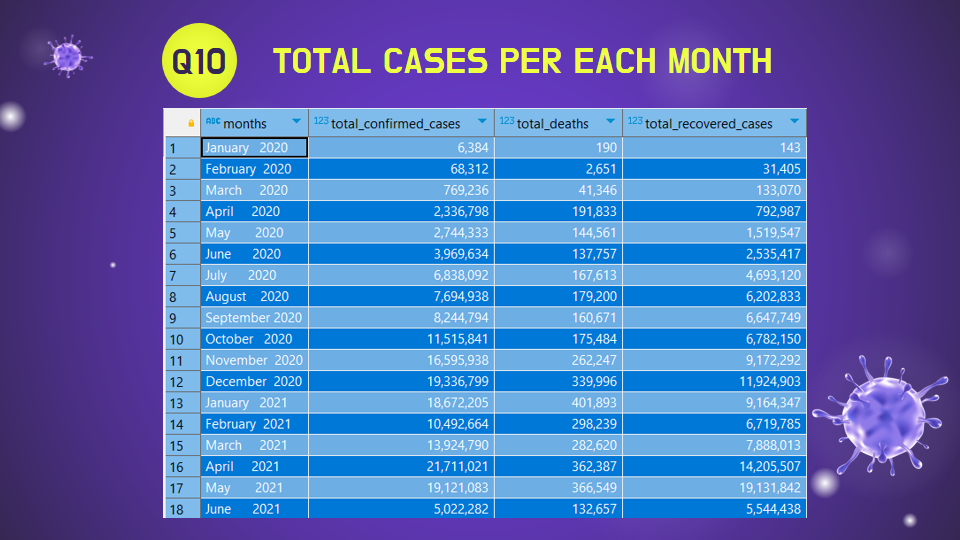

# 🌍 Corona Virus Analysis Project

Welcome to the Corona Virus Analysis project! This repository contains the SQL queries for the insights, derived from analyzing a comprehensive COVID-19 dataset. 

## 📊 Project Overview

The COVID-19 pandemic has profoundly impacted public health globally, creating an urgent need for data-driven insights to understand the virus's spread. As a data analyst, I've analyzed the COVID-19 dataset to derive meaningful insights and present my findings.

## 🗂️ Dataset Description

The dataset includes the following columns:

- **Province**: Geographic subdivision within a country/region.
- **Country/Region**: Geographic entity where data is recorded.
- **Latitude**: North-south position on Earth's surface.
- **Longitude**: East-west position on Earth's surface.
- **Date**: Recorded date of COVID-19 data.
- **Confirmed**: Number of diagnosed COVID-19 cases.
- **Deaths**: Number of COVID-19 related deaths.
- **Recovered**: Number of recovered COVID-19 cases.

## 🔍 Analysis Tasks

Here's a breakdown of the tasks performed:

1. ✅ **Check for NULL values**
2. 🔄 **Update NULL values with zeros**
3. 📏 **Check total number of rows**
4. 📅 **Find start and end dates**
5. 🗓️ **Count number of months in the dataset**
6. 📈 **Calculate monthly averages for confirmed, deaths, and recovered cases**
7. 📊 **Find the most frequent values for confirmed, deaths, and recovered cases each month**
8. 📉 **Find minimum values for confirmed, deaths, and recovered cases per year**
9. 📈 **Find maximum values for confirmed, deaths, and recovered cases per year**
10. 🗃️ **Calculate total cases of confirmed, deaths, and recovered each month**
11. 🦠 **Analyze the spread of the virus with respect to confirmed cases (total, average, variance, standard deviation)**
12. ⚰️ **Analyze the spread of the virus with respect to death cases per month (total, average, variance, standard deviation)**
13. 💪 **Analyze the spread of the virus with respect to recovered cases (total, average, variance, standard deviation)**
14. 🌍 **Identify the country with the highest number of confirmed cases**
15. 🕊️ **Identify the country with the lowest number of death cases**
16. 🏆 **Find the top 5 countries with the highest number of recovered cases**

## 🌟 Insights & Findings

## 🛠️ Technologies Used

- PostgreSQL
- DBeaver
- psql 

## 🤝 Contributing
Contributions are welcome! Please feel free to submit a pull request or open an issue.
